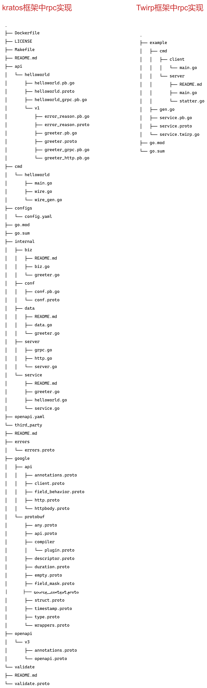

# RPC gRPC Twirp ProtoBuf之间的关系

简单介绍这几个项目的关系:

- ProtoBuf是一种序列化数据结构的协议
- protoc是一个能把proto数据结构转换为各种语言代码的工具
- RPC是一种通信协议
- gRPC是一种使用ProtoBuf作为接口描述语言的一个RPC实现方案

# RPC

在分布式计算，远程过程调用(Remote Procedure Call，缩写为 RPC)是一个计算机通信协议。该协议允许运行于一台计算机的程序调用另一个地址空间(通常为一个开放网络的一台计算机)的子程序，而程序员就像**调用本地程序一样**，无需额外地为这个交互作用编程(无需关注细节)。RPC是一种**服务器-客户端(Client/Server)模式**，经典实现是一个通过发送请求-接受回应进行信息交互的系统。
RPC是一种进程间通信的模式，程序分布在不同的地址空间里。如果在同一主机里，RPC可以通过不同的虚拟地址空间(即便使用相同的物理地址)进行通讯，而在不同的主机间，则通过不同的物理地址进行交互。许多技术(常常是不兼容)都是基于这种概念而实现的。


# ProtoBuf
Protocol Buffers(简称ProtoBuf)是一种序列化数据结构的协议。对于透过管道(pipeline)或存储资料进行通信的程序开发上是很有用的。这个方法包含一个接口描述语言，描述一些数据结构，并提供程序工具根据这些>描述产生代码，用于将这些数据结构产生或解析资料流。[官方文档-Language Guide (proto3)](https://protobuf.dev/overview/)


# Protoc([Protocol Compiler](https://github.com/protocolbuffers/protobuf)编译器)
要生成Java、Python、C ++、Go、Ruby、Objective-C或C#代码，您需要使用.proto文件中定义的消息类型，需要在.proto上运行协议缓冲区编译器协议。如果尚未安装编译器，请下载软件包并按照自述文件中的说明进行操作。对于Go，还需要为编译器安装一个特殊的代码生成器插件，请阅读Go Generated Code。
## protoc-gen-go([生成go代码插件](https://github.com/protocolbuffers/protobuf-go))
protocol buffer编译器需要一个插件来生成Go代码


# GRPC
gRPC(gRPC Remote Procedure Calls)是Google发起的一个开源远程过程调用(Remote procedure call)系统。该系统基于HTTP/2协议传输，使用Protocol Buffers作为接口描述语言。***实现RPC协议的框架***。
其他功能：
- 认证(authentication)
- 双向流(bidirectional streaming)
- 流控制(flow control)
- 超时(timeouts)

可能的使用场景：
- 内部微服务之间的通信。
- 高数据负载(gRPC 使用协议缓冲区，其速度最高可比 REST 调用快七倍)。
- 您只需要一个简单的服务定义，不需要编写完整的客户端库。
- 在gRPC服务器中使用流式传输gRPC来构建响应更快的应用和 API。

# Twirp[是一个基于 Google Protobuf 的 RPC 框架](https://twitchtv.github.io/twirp/docs/intro.html)
Twirp通过在.proto文件中定义服务，然后自动生产服务器和客户端的代码。让我们可以将更多的精力放在业务逻辑上。咦？这不就是 gRPC 吗？不同的是，gRPC 自己实现了一套 HTTP 服务器和网络传输层，twirp 使用标准库net/http。另外 gRPC 只支持 HTTP/2 协议，twirp 还可以运行在 HTTP 1.1 之上。同时 twirp 还可以使用 JSON 格式交互。当然并不是说 twirp 比 gRPC 好，只是多了解一种框架也就多了一个选择。





# kratos框架项目结构：
```bash
├── Dockerfile
├── LICENSE
├── Makefile
├── README.md
├── api
│   └── helloworld
│       ├── helloworld.pb.go   // protobuf生成的go的代码
│       ├── helloworld.proto   // proto协议文件原始定义
│       ├── helloworld_grpc.pb.go    // --go_out=plugins=grpc:service go插件生成的grpc协议文件
│       └── v1
│           ├── error_reason.pb.go
│           ├── error_reason.proto
│           ├── greeter.pb.go
│           ├── greeter.proto
│           ├── greeter_grpc.pb.go    // grpc客户端/服务端rpc调用
│           └── greeter_http.pb.go    // restful api net/http 调用
├── cmd
│   └── helloworld
│       ├── main.go
│       ├── wire.go
│       └── wire_gen.go
├── configs
│   └── config.yaml
├── go.mod
├── go.sum
├── internal
│   ├── biz
│   │   ├── README.md
│   │   ├── biz.go
│   │   └── greeter.go
│   ├── conf
│   │   ├── conf.pb.go
│   │   └── conf.proto
│   ├── data
│   │   ├── README.md
│   │   ├── data.go
│   │   └── greeter.go
│   ├── server
│   │   ├── grpc.go
│   │   ├── http.go
│   │   └── server.go
│   └── service
│       ├── README.md
│       ├── greeter.go
│       ├── helloworld.go
│       └── service.go
├── openapi.yaml
└── third_party
    ├── README.md
    ├── errors
    │   └── errors.proto
    ├── google
    │   ├── api
    │   └── v3
    │       ├── annotations.proto
    │       └── openapi.proto
    └── validate
        ├── README.md
        └── validate.proto

```
kratos框架我们了解到定义原始的proto文件、会帮我们生成**符合服务间调用的grpc(client/server)源代码、以及对外暴露的restful api既符合protobuf协议又符合json格式的数据、一举两得，可以让我们专注于业务逻辑的处理***。

## Kratos 一套轻量级 Go 微服务框架，包含大量微服务相关功能及工具
> 名字来源于:《战神》游戏以希腊神话为背景，讲述奎托斯（Kratos）由凡人成为战神并展开弑神屠杀的冒险经历。

Principles
- 简单：不过度设计，代码平实简单；
- 通用：通用业务开发所需要的基础库的功能；
- 高效：提高业务迭代的效率；
- 稳定：基础库可测试性高，覆盖率高，有线上实践安全可靠；
- 健壮：通过良好的基础库设计，减少错用；
- 高性能：性能高，但不特定为了性能做 hack 优化，引入 unsafe ；
- 扩展性：良好的接口设计，来扩展实现，或者通过新增基础库目录来扩展功能；
- 容错性：为失败设计，大量引入对 SRE 的理解，鲁棒性高；
- 工具链：包含大量工具链，比如 cache 代码生成，lint 工具等等

## Features

- APIs ：协议通信以 HTTP/gRPC 为基础，通过 Protobuf 进行定义；
- Errors ：通过 Protobuf 的 Enum 作为错误码定义，以及工具生成判定接口；
- Metadata ：在协议通信 HTTP/gRPC 中，通过 Middleware 规范化服务元信息传递；
- Config ：支持多数据源方式，进行配置合并铺平，通过 Atomic 方式支持动态配置；
- Logger ：标准日志接口，可方便集成三方 log 库，并可通过 fluentd 收集日志；
- Metrics ：统一指标接口，可以实现各种指标系统，默认集成 Prometheus；
- Tracing ：遵循 OpenTelemetry 规范定义，以实现微服务链路追踪；
- Encoding ：支持 Accept 和 Content-Type 进行自动选择内容编码；
- Transport ：通用的 HTTP /gRPC 传输层，实现统一的 Middleware 插件支持；
- Registry ：实现统一注册中心接口，可插件化对接各种注册中心；
- Validation: 通过Protobuf统一定义校验规则，并同时适用于HTTP/gRPC服务.
- SwaggerAPI: 通过集成第三方Swagger插件 能够自动生成Swagger API json并启动一个内置的Swagger UI服务.

## kratos 强大的grpc和http兼容能力、服务端注册源码
### http server
```go
package server

import (
	v1 "helloworld/api/helloworld/v1"
	"helloworld/internal/conf"
	"helloworld/internal/service"

	"github.com/go-kratos/kratos/v2/log"
	"github.com/go-kratos/kratos/v2/middleware/recovery"
	"github.com/go-kratos/kratos/v2/transport/http"
)

// NewHTTPServer new an HTTP server.
func NewHTTPServer(c *conf.Server, greeter *service.GreeterService, logger log.Logger) *http.Server {
	var opts = []http.ServerOption{
		http.Middleware(
			recovery.Recovery(),
		),
	}
	if c.Http.Network != "" {
		opts = append(opts, http.Network(c.Http.Network))
	}
	if c.Http.Addr != "" {
		opts = append(opts, http.Address(c.Http.Addr))
	}
	if c.Http.Timeout != nil {
		opts = append(opts, http.Timeout(c.Http.Timeout.AsDuration()))
	}
	srv := http.NewServer(opts...)
	v1.RegisterGreeterHTTPServer(srv, greeter)
	return srv
}

```

### grpc server

```go
package server

import (
	v1 "helloworld/api/helloworld/v1"
	"helloworld/internal/conf"
	"helloworld/internal/service"

	"github.com/go-kratos/kratos/v2/log"
	"github.com/go-kratos/kratos/v2/middleware/recovery"
	"github.com/go-kratos/kratos/v2/transport/grpc"
)

// NewGRPCServer new a gRPC server.
func NewGRPCServer(c *conf.Server, greeter *service.GreeterService, logger log.Logger) *grpc.Server {
	var opts = []grpc.ServerOption{
		grpc.Middleware(
			recovery.Recovery(),
		),
	}
	if c.Grpc.Network != "" {
		opts = append(opts, grpc.Network(c.Grpc.Network))
	}
	if c.Grpc.Addr != "" {
		opts = append(opts, grpc.Address(c.Grpc.Addr))
	}
	if c.Grpc.Timeout != nil {
		opts = append(opts, grpc.Timeout(c.Grpc.Timeout.AsDuration()))
	}
	srv := grpc.NewServer(opts...)
	v1.RegisterGreeterServer(srv, greeter)
	return srv
}

```

以上kratos框架的server端可以同时监听grpc server和http server

### protoc-gen-go-grpc
```go
// Code generated by protoc-gen-go-grpc. DO NOT EDIT.
// versions:
// - protoc-gen-go-grpc v1.2.0
// - protoc             v3.19.3
// source: helloworld/v1/greeter.proto

package v1

import (
	context "context"
	grpc "google.golang.org/grpc"
	codes "google.golang.org/grpc/codes"
	status "google.golang.org/grpc/status"
)

// This is a compile-time assertion to ensure that this generated file
// is compatible with the grpc package it is being compiled against.
// Requires gRPC-Go v1.32.0 or later.
const _ = grpc.SupportPackageIsVersion7

// GreeterClient is the client API for Greeter service.
//
// For semantics around ctx use and closing/ending streaming RPCs, please refer to https://pkg.go.dev/google.golang.org/grpc/?tab=doc#ClientConn.NewStream.
type GreeterClient interface {
	// Sends a greeting
	SayHello(ctx context.Context, in *HelloRequest, opts ...grpc.CallOption) (*HelloReply, error)
}

type greeterClient struct {
	cc grpc.ClientConnInterface
}

func NewGreeterClient(cc grpc.ClientConnInterface) GreeterClient {
	return &greeterClient{cc}
}

func (c *greeterClient) SayHello(ctx context.Context, in *HelloRequest, opts ...grpc.CallOption) (*HelloReply, error) {
	out := new(HelloReply)
	err := c.cc.Invoke(ctx, "/helloworld.v1.Greeter/SayHello", in, out, opts...)
	if err != nil {
		return nil, err
	}
	return out, nil
}

// GreeterServer is the server API for Greeter service.
// All implementations must embed UnimplementedGreeterServer
// for forward compatibility
type GreeterServer interface {
	// Sends a greeting
	SayHello(context.Context, *HelloRequest) (*HelloReply, error)
	mustEmbedUnimplementedGreeterServer()
}

// UnimplementedGreeterServer must be embedded to have forward compatible implementations.
type UnimplementedGreeterServer struct {
}

func (UnimplementedGreeterServer) SayHello(context.Context, *HelloRequest) (*HelloReply, error) {
	return nil, status.Errorf(codes.Unimplemented, "method SayHello not implemented")
}
func (UnimplementedGreeterServer) mustEmbedUnimplementedGreeterServer() {}

// UnsafeGreeterServer may be embedded to opt out of forward compatibility for this service.
// Use of this interface is not recommended, as added methods to GreeterServer will
// result in compilation errors.
type UnsafeGreeterServer interface {
	mustEmbedUnimplementedGreeterServer()
}

func RegisterGreeterServer(s grpc.ServiceRegistrar, srv GreeterServer) {
	s.RegisterService(&Greeter_ServiceDesc, srv)
}

func _Greeter_SayHello_Handler(srv interface{}, ctx context.Context, dec func(interface{}) error, interceptor grpc.UnaryServerInterceptor) (interface{}, error) {
	in := new(HelloRequest)
	if err := dec(in); err != nil {
		return nil, err
	}
	if interceptor == nil {
		return srv.(GreeterServer).SayHello(ctx, in)
	}
	info := &grpc.UnaryServerInfo{
		Server:     srv,
		FullMethod: "/helloworld.v1.Greeter/SayHello",
	}
	handler := func(ctx context.Context, req interface{}) (interface{}, error) {
		return srv.(GreeterServer).SayHello(ctx, req.(*HelloRequest))
	}
	return interceptor(ctx, in, info, handler)
}

// Greeter_ServiceDesc is the grpc.ServiceDesc for Greeter service.
// It's only intended for direct use with grpc.RegisterService,
// and not to be introspected or modified (even as a copy)
var Greeter_ServiceDesc = grpc.ServiceDesc{
	ServiceName: "helloworld.v1.Greeter",
	HandlerType: (*GreeterServer)(nil),
	Methods: []grpc.MethodDesc{
		{
			MethodName: "SayHello",
			Handler:    _Greeter_SayHello_Handler,
		},
	},
	Streams:  []grpc.StreamDesc{},
	Metadata: "helloworld/v1/greeter.proto",
}

```


### protoc-gen-go-http

```go
// Code generated by protoc-gen-go-http. DO NOT EDIT.
// versions:
// protoc-gen-go-http v2.1.3

package v1

import (
	context "context"
	http "github.com/go-kratos/kratos/v2/transport/http"
	binding "github.com/go-kratos/kratos/v2/transport/http/binding"
)

// This is a compile-time assertion to ensure that this generated file
// is compatible with the kratos package it is being compiled against.
var _ = new(context.Context)
var _ = binding.EncodeURL

const _ = http.SupportPackageIsVersion1

type GreeterHTTPServer interface {
	SayHello(context.Context, *HelloRequest) (*HelloReply, error)
}

func RegisterGreeterHTTPServer(s *http.Server, srv GreeterHTTPServer) {
	r := s.Route("/")
	r.GET("/helloworld/{name}", _Greeter_SayHello0_HTTP_Handler(srv))
}

func _Greeter_SayHello0_HTTP_Handler(srv GreeterHTTPServer) func(ctx http.Context) error {
	return func(ctx http.Context) error {
		var in HelloRequest
		if err := ctx.BindQuery(&in); err != nil {
			return err
		}
		if err := ctx.BindVars(&in); err != nil {
			return err
		}
		http.SetOperation(ctx, "/helloworld.v1.Greeter/SayHello")
		h := ctx.Middleware(func(ctx context.Context, req interface{}) (interface{}, error) {
			return srv.SayHello(ctx, req.(*HelloRequest))
		})
		out, err := h(ctx, &in)
		if err != nil {
			return err
		}
		reply := out.(*HelloReply)
		return ctx.Result(200, reply)
	}
}

type GreeterHTTPClient interface {
	SayHello(ctx context.Context, req *HelloRequest, opts ...http.CallOption) (rsp *HelloReply, err error)
}

type GreeterHTTPClientImpl struct {
	cc *http.Client
}

func NewGreeterHTTPClient(client *http.Client) GreeterHTTPClient {
	return &GreeterHTTPClientImpl{client}
}

func (c *GreeterHTTPClientImpl) SayHello(ctx context.Context, in *HelloRequest, opts ...http.CallOption) (*HelloReply, error) {
	var out HelloReply
	pattern := "/helloworld/{name}"
	path := binding.EncodeURL(pattern, in, true)
	opts = append(opts, http.Operation("/helloworld.v1.Greeter/SayHello"))
	opts = append(opts, http.PathTemplate(pattern))
	err := c.cc.Invoke(ctx, "GET", path, nil, &out, opts...)
	if err != nil {
		return nil, err
	}
	return &out, err
}

```

# Twirp 框架demo项目结构
```bash
~/go/src/twirp-helloworld/example                                                                                                                                                                     19:59:52 
❯                                19:59:52 
│       └── statter.go
├── gen.go
├── service.pb.go
│   ├── cmd
│   │   ├── client
│   │   │   └── main.go
│   │   └── server
│   │       ├── README.md
│   │       ├── main.go
│   │       └── statter.go
│   ├── gen.go
│   ├── service.pb.go
│   ├── service.proto
│   └── service.twirp.go   // go插件twirp生成协议文件 --twirp_out=. rpc/haberdasher/service.proto
├── go.mod
└── go.sum
```

## Twirp框架rpc实现
```go
// Copyright 2018 Twitch Interactive, Inc.  All Rights Reserved.
//
// Licensed under the Apache License, Version 2.0 (the "License"). You may not
// use this file except in compliance with the License. A copy of the License is
// located at
//
//     http://www.apache.org/licenses/LICENSE-2.0
//
// or in the "license" file accompanying this file. This file is distributed on
// an "AS IS" BASIS, WITHOUT WARRANTIES OR CONDITIONS OF ANY KIND, either
// express or implied. See the License for the specific language governing
// permissions and limitations under the License.

package main

import (
	"context"
	"log"
	"math/rand"
	"net/http"
	"os"

	"github.com/twitchtv/twirp"
	"github.com/twitchtv/twirp/example"
	"github.com/twitchtv/twirp/hooks/statsd"
)

type randomHaberdasher struct{}

func (h *randomHaberdasher) MakeHat(ctx context.Context, size *example.Size) (*example.Hat, error) {
	if size.Inches <= 0 {
		return nil, twirp.InvalidArgumentError("Inches", "I can't make a hat that small!")
	}
	colors := []string{"white", "black", "brown", "red", "blue"}
	names := []string{"bowler", "baseball cap", "top hat", "derby"}
	return &example.Hat{
		Size:  size.Inches,
		Color: colors[rand.Intn(len(colors))],
		Name:  names[rand.Intn(len(names))],
	}, nil
}

func main() {
	hook := statsd.NewStatsdServerHooks(LoggingStatter{os.Stderr})
	server := example.NewHaberdasherServer(&randomHaberdasher{}, hook)
	log.Fatal(http.ListenAndServe(":8080", server))
}

```

### RestFulApi
```shell
curl --request "POST" \
    --header "Content-Type: application/json" \
    --data '{"inches": 0}' \
    http://127.0.0.1:8080/twirp/twitch.twirp.example.Haberdasher/MakeHat
{"code":"invalid_argument","msg":"Inches I can't make a hat that small!","meta":{"argument":"Inches"}}%
```

### protobuf 格式
```go
// Copyright 2018 Twitch Interactive, Inc.  All Rights Reserved.
//
// Licensed under the Apache License, Version 2.0 (the "License"). You may not
// use this file except in compliance with the License. A copy of the License is
// located at
//
//     http://www.apache.org/licenses/LICENSE-2.0
//
// or in the "license" file accompanying this file. This file is distributed on
// an "AS IS" BASIS, WITHOUT WARRANTIES OR CONDITIONS OF ANY KIND, either
// express or implied. See the License for the specific language governing
// permissions and limitations under the License.

package main

import (
	"context"
	"fmt"
	"log"
	"net/http"

	"github.com/twitchtv/twirp"
	"github.com/twitchtv/twirp/example"
)

func main() {
	client := example.NewHaberdasherJSONClient("http://localhost:8080", &http.Client{})
              //proto:=example.NewHaberdasherProtobufClient("http://localhost:8080", &http.Client{})
	var (
		hat *example.Hat
		err error
	)
	for i := 0; i < 5; i++ {
		hat, err = client.MakeHat(context.Background(), &example.Size{Inches: 12})
		if err != nil {
			if twerr, ok := err.(twirp.Error); ok {
				if twerr.Meta("retryable") != "" {
					// Log the error and go again.
					log.Printf("got error %q, retrying", twerr)
					continue
				}
			}
			// This was some fatal error!
			log.Fatal(err)
		}
	}
	fmt.Printf("%+v", hat)
}
```