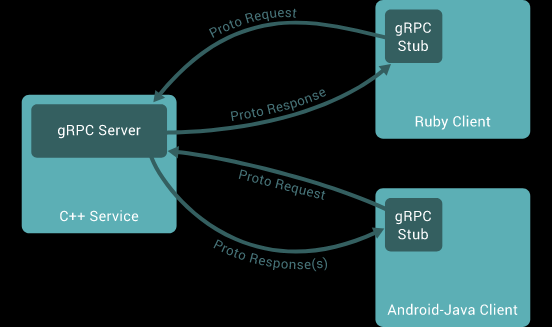

# RPC gRPC Twirp ProtoBuf之间的关系

简单介绍这几个项目的关系:

- ProtoBuf是一种序列化数据结构的协议
- protoc是一个能把proto数据结构转换为各种语言代码的工具
- RPC是一种通信协议
- gRPC是一种使用ProtoBuf作为接口描述语言的一个RPC实现方案

# RPC

在分布式计算，远程过程调用(Remote Procedure Call，缩写为 RPC)是一个计算机通信协议。该协议允许运行于一台计算机的程序调用另一个地址空间(通常为一个开放网络的一台计算机)的子程序，而程序员就像**调用本地程序一样**，无需额外地为这个交互作用编程(无需关注细节)。RPC是一种**服务器-客户端(Client/Server)模式**，经典实现是一个通过发送请求-接受回应进行信息交互的系统。
RPC是一种进程间通信的模式，程序分布在不同的地址空间里。如果在同一主机里，RPC可以通过不同的虚拟地址空间(即便使用相同的物理地址)进行通讯，而在不同的主机间，则通过不同的物理地址进行交互。许多技术(常常是不兼容)都是基于这种概念而实现的。

# ProtoBuf
Protocol Buffers(简称ProtoBuf)是一种序列化数据结构的协议。对于透过管道(pipeline)或存储资料进行通信的程序开发上是很有用的。这个方法包含一个接口描述语言，描述一些数据结构，并提供程序工具根据这些>描述产生代码，用于将这些数据结构产生或解析资料流。[官方文档-Language Guide (proto3)](https://protobuf.dev/overview/)

# Protoc([Protocol Compiler](https://github.com/protocolbuffers/protobuf)编译器)
要生成Java、Python、C ++、Go、Ruby、Objective-C或C#代码，您需要使用.proto文件中定义的消息类型，需要在.proto上运行协议缓冲区编译器协议。如果尚未安装编译器，请下载软件包并按照自述文件中的说明进行操作。对于Go，还需要为编译器安装一个特殊的代码生成器插件，请阅读Go Generated Code。
## protoc-gen-go([生成go代码插件](https://github.com/protocolbuffers/protobuf-go))
protocol buffer编译器需要一个插件来生成Go代码

# GRPC
gRPC(gRPC Remote Procedure Calls)是Google发起的一个开源远程过程调用(Remote procedure call)系统。该系统基于HTTP/2协议传输，使用Protocol Buffers作为接口描述语言。***实现RPC协议的框架***。
其他功能：
- 认证(authentication)
- 双向流(bidirectional streaming)
- 流控制(flow control)
- 超时(timeouts)

可能的使用场景：
- 内部微服务之间的通信。
- 高数据负载(gRPC 使用协议缓冲区，其速度最高可比 REST 调用快七倍)。
- 您只需要一个简单的服务定义，不需要编写完整的客户端库。
- 在gRPC服务器中使用流式传输gRPC来构建响应更快的应用和 API。

# Twirp[是一个基于 Google Protobuf 的 RPC 框架](https://twitchtv.github.io/twirp/docs/intro.html)
Twirp通过在.proto文件中定义服务，然后自动生产服务器和客户端的代码。让我们可以将更多的精力放在业务逻辑上。咦？这不就是 gRPC 吗？不同的是，gRPC 自己实现了一套 HTTP 服务器和网络传输层，twirp 使用标准库net/http。另外 gRPC 只支持 HTTP/2 协议，twirp 还可以运行在 HTTP 1.1 之上。同时 twirp 还可以使用 JSON 格式交互。当然并不是说 twirp 比 gRPC 好，只是多了解一种框架也就多了一个选择。