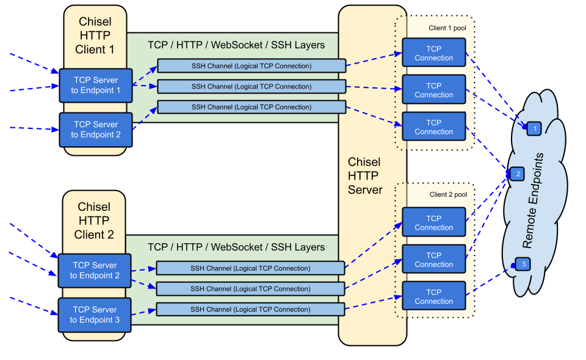

# 代理 Kubernetes API Server【Reverse Tunneling Dialer】

# 项目Tower概述
  - 背景：在多集群管理场景下，对于运行在私有网络、裸金属服务、VM、容器中等环境中的Kubernetes集群，纳管受限、无法提供统一的集群管理入口
    混合、多云环境中变得分散割裂、集群维护困难、无法对集群的全生命周期进行维护、应用交付受限

  - 应用场景：
    - 暴露本地集群到公网环境，本地Kubernetes集群上获取公共LoadBalancer
    - 受托管的集群可以运行在云上（ACK、CCE、TKE）或云下（IDC）、 self-hosted Kubernetes cluster
    - Kubernetes API服务器代理允许Kubernete集群之外的用户连接到可能无法访问的集群IP。
    - 允许访问仅在集群网络中公开的服务。
    - apiserver充当用户和集群内端点之间的代理和堡垒。
    
  - API Server
  - kube-apiserver 是 Kubernetes 最重要的核心组件之一，主要提供以下的功能
    - 提供集群管理的 REST API 接口，包括认证授权、数据校验以及集群状态变更等
    - 提供其他模块之间的数据交互和通信的枢纽（其他模块通过 API Server 查询或修改数据，只有 API Server 才直接操作 etcd）
  - kube-apiserver 提供了 Kubernetes 的 REST API，实现了认证、授权、准入控制等安全校验功能，同时也负责集群状态的存储操作（通过 etcd）。
  
  - rest api:
    `
    curl -v -H 'Content-Type: application/json' \
    "http://localhost:${PORT}/api/v1/namespaces/default/pods/${POD}/status" >"${POD}-orig.json"
    `
  - Tunnel Server
    - 底层采用了HTTP进行传输，将TCP/UDP链接封装在HTTP隧道中，并且还使用了SSH对通信数据进行加密。
    - Architecture
    
  - Tower组成核心模块
    - Tunnel Server
    - Proxy代理模块、充当Kubernetes API Server代理的服务端
      - k8sproxy.NewUpgradeAwareHandler
        ````
        func (s *Server) ServeHTTP(w http.ResponseWriter, req *http.Request) {
        u := *req.URL
        u.Host = s.host
        u.Scheme = s.scheme

        fmt.Printf("req.URL:%s\nreq.Body:%s\nreq.Header:%s\nreq.Host:%s\n", req.URL, req.Body, req.Header, req.Host)

        if s.useBearerToken && len(s.bearerToken) > 0 {
        req = utilnet.CloneRequest(req)
        req.Header.Set("Authorization", fmt.Sprintf("Bearer %s", s.bearerToken))
        }

        // we choose one httpClient randomly
        rand.Seed(time.Now().UnixNano())
        s.rwLock.RLock()
        index := rand.Intn(len(s.httpClient))
        klog.V(5).Infof("server %s current agent connection length %d, random slice index %d", s.name, len(s.httpClient), index)
        httpProxy := k8sproxy.NewUpgradeAwareHandler(&u, s.httpClient[index].Transport, false, false, s)
        s.rwLock.RUnlock()

        httpProxy.ServeHTTP(w, req)
        }
    - Agent模块应用在客户集群、对外暴露集群服务
       
      ````
      func (agent *Agent) connectionLoop() {
      var connectionErr error
      b := &backoff.Backoff{
      Factor: 1.4, // for faster reconnection
      Max:    agent.options.MaxRetryInterval,
      }
      for agent.running {
      if connectionErr != nil {
      attempt := int(b.Attempt())
      maxAttempt := agent.options.MaxRetryCount
      d := b.Duration()

    		msg := fmt.Sprintf("Connection error: %s", connectionErr)
    		if attempt > 0 {
    			msg += fmt.Sprintf(" (Attempt: %d", attempt)
    			if maxAttempt > 0 {
    				msg += fmt.Sprintf("/%d", maxAttempt)
    			}
    			msg += ")"
    		}
    		klog.Warning(msg)

    		if maxAttempt > 0 && attempt >= maxAttempt {
    			break
    		}
    		klog.Warningf("Retrying in %s...", d)
    		connectionErr = nil

    		sig := make(chan os.Signal, 1)
    		signal.Notify(sig, syscall.SIGHUP)
    		select {
    		case <-time.After(d):
    		case <-sig:
    		}
    		signal.Stop(sig)
    	}

    	dialer := websocket.Dialer{
    		ReadBufferSize:   1024,
    		WriteBufferSize:  1024,
    		HandshakeTimeout: 45 * time.Second,
    		Subprotocols:     []string{version.ProtocolVersion},
    		Proxy:            http.ProxyFromEnvironment,
    	}

    	wsHeaders := http.Header{}

    	wsConn, _, err := dialer.Dial(agent.options.Server, wsHeaders)
    	if err != nil {
    		connectionErr = err
    		continue
    	}

    	conn := utils.NewWebSocketConn(wsConn)
    	klog.V(4).Info("Handshaking...")
    	sshConn, chans, reqs, err := ssh.NewClientConn(conn, "", agent.sshConfig)
    	if err != nil {
    		if strings.Contains(err.Error(), "unable to authenticate") {
    			klog.Error("Authentication failed", err)
    		} else {
    			klog.Error(err)
    		}
    		break
    	}

    	conf, _ := agent.config.Marshal()
    	klog.V(4).Info("Sending config")
    	t0 := time.Now()
    	_, configErr, err := sshConn.SendRequest("config", true, conf)
    	if err != nil {
    		klog.Error("Config verification failed", err)
    		break
    	}

    	// we may encounter error like 'A session already allocated for this client.'
    	// continue can be helpful while we execute 'kubectl rollout restart -n kubesphere-system deployment cluster-agent'
    	// see issue #29
    	if len(configErr) > 0 {
    		connectionErr = errors.New(string(configErr))
    		continue
    	}

    	klog.V(2).Infof("Connected (Latency %s)", time.Since(t0))
    	b.Reset()
    	agent.sshConn = sshConn
    	go ssh.DiscardRequests(reqs)
    	go agent.connectStreams(chans)

    	err = sshConn.Wait()
    	agent.sshConn = nil
    	if err != nil && err != io.EOF {
    		connectionErr = err
    		continue
    	}
    	klog.V(2).Info("Disconnected")
        }
        close(agent.runningC)
        }  
  - Tower代理模块依赖关系
    - entity
      
      - proxy服务端维护ws连接会话，用于代理转发客户端请求sessions会话map[string]*HTTPProxy
      - 基于raft算法实现的leaderelection选举机制
        ````
        lock, err := resourcelock.New(resourcelock.LeasesResourceLock,
				"kubesphere-system",
				"tower",
				kubernetesClient.CoreV1(),
				kubernetesClient.CoordinationV1(),
				resourcelock.ResourceLockConfig{
					Identity: id,
					EventRecorder: record.NewBroadcaster().NewRecorder(scheme.Scheme, v1.EventSource{
						Component: "tower",
					}),
				})

			if err != nil {
				klog.Fatalf("error creating lock: %v", err)
			}

			leaderelection.RunOrDie(ctx, leaderelection.LeaderElectionConfig{
				Lock:          lock,
				LeaseDuration: options.LeaderElection.LeaseDuration,
				RenewDeadline: options.LeaderElection.RenewDeadline,
				RetryPeriod:   options.LeaderElection.RetryPeriod,
				Callbacks: leaderelection.LeaderCallbacks{
					OnStartedLeading: run,
					OnStoppedLeading: func() {
						klog.Errorf("leadership lost")
						os.Exit(0)
           },
           },
           })
      - agent基于backoff的心跳维护机制、保证代理链接的可用性
      
    https://kinvolk.io/blog/2019/02/abusing-kubernetes-api-server-proxying/
  
